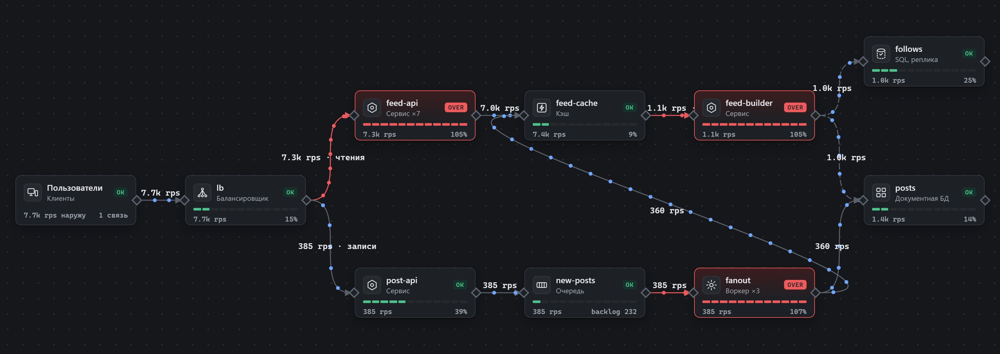
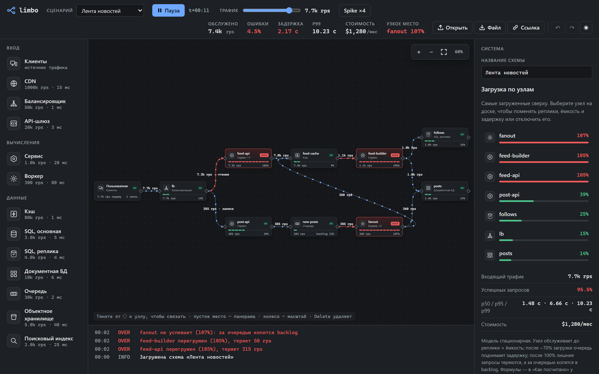
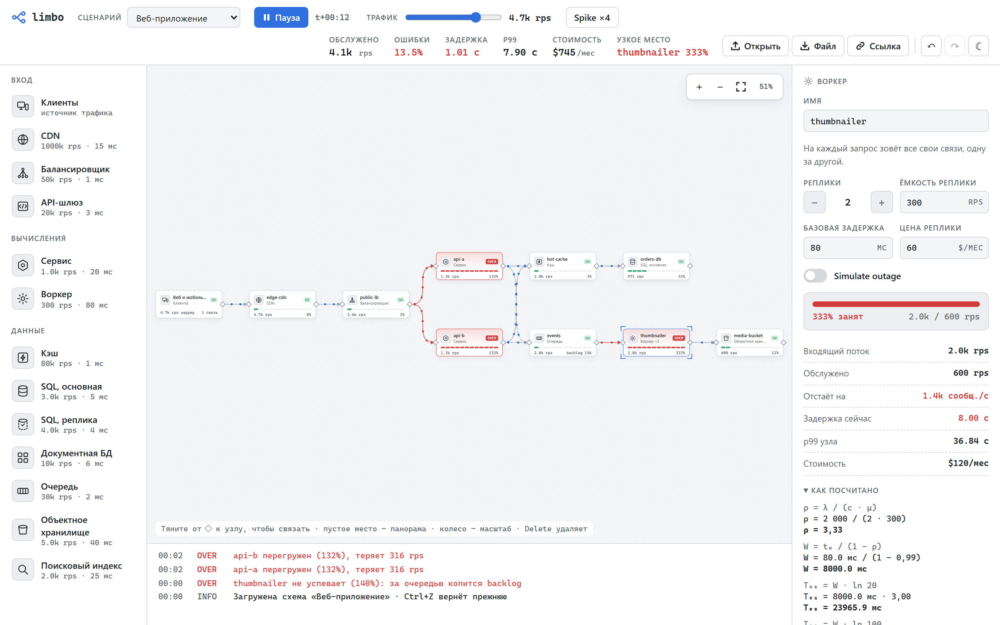

# limbo

[English](README.md) · **Русский**

Доска, на которой архитектуру рисуют и сразу прогоняют под нагрузкой: draw.io, который умеет считать.



Стек: Angular 22 на клиенте, .NET 10 на сервере. Движок симуляции работает в браузере, сервер хранит схемы и раздаёт короткие ссылки. Подробности — в `docs/`.

## Скриншоты

Лента новостей под нагрузкой: в шапке узкое место, ошибки, p99 и стоимость, справа узлы по загрузке, в логе перегрузы.



Светлая тема, выбран воркер: реплики, ёмкость и задержка правятся на месте, а «Как посчитано» показывает формулы с реальными числами.



## Структура

```
limbo/
├─ spec/                     общий источник правды: JSON Schema, пресеты, эталонные сценарии
├─ web/                      pnpm workspace
│  ├─ packages/engine/       движок симуляции, чистый TS
│  ├─ packages/model/        типы, сгенерированные из JSON Schema
│  ├─ packages/api-client/   клиент API
│  ├─ landing/               лендинг: статика на /, живое демо на движке
│  ├─ scripts/               сборка сайта: лендинг на /, доска на /app/
│  └─ app/                   Angular 22
├─ server/                   решение .NET 10 (Loadline.slnx)
│  ├─ src/Loadline.Api/      Minimal API
│  ├─ src/Loadline.Core/     валидация схем, slug, токены
│  ├─ src/Loadline.Data/     EF Core 10 + PostgreSQL
│  ├─ src/Loadline.AppHost/  Aspire: Postgres + API одной командой
│  └─ tests/                 xUnit v3, Testcontainers
├─ docs/                     «Как считаем», ADR
├─ deploy/                   Dockerfile, compose, Caddy, бэкапы
└─ .github/workflows/        CI
```

## Что нужно

- Node.js 24.15+ и pnpm 10 (`corepack enable`)
- .NET SDK 10
- Docker (для Postgres через Aspire и для интеграционных тестов)

## Запуск

```powershell
# 1. Фронт и движок
cd web
pnpm install
pnpm build          # model → engine → api-client → app
pnpm test           # тесты движка (golden + свойства) и приложения
pnpm start          # доска: http://localhost:4200
pnpm start:landing  # лендинг: http://localhost:4300
pnpm build:site     # сайт как на хостинге в web/dist/site: лендинг на /, доска на /app/

# 2. Сервер (в другом терминале)
cd server
dotnet run --project src/Loadline.AppHost   # Postgres в Docker + API на :5080
```

Фронт работает и без сервера: симуляция идёт в браузере. Запросы `/api` dev-сервер Angular проксирует на `localhost:5080`.

Без Aspire: поднимите Postgres сами (`loadline/loadline`, база `loadline`) и запустите `dotnet run --project src/Loadline.Api`.

## Миграции базы

Миграции EF Core лежат в `server/src/Loadline.Data/Migrations`. API в режиме Development применяет их сам при старте. `dotnet-ef` закреплён в `server/dotnet-tools.json`, и его версия совпадает с EF Core.

```powershell
cd server
dotnet tool restore
dotnet tool run dotnet-ef migrations add <Имя> -p src/Loadline.Data -s src/Loadline.Data -o Migrations
```

CI проверяет, что миграции покрывают модель (`has-pending-model-changes`).

## Выкладка

Фронт — статика на Cloudflare Pages, API и Postgres — на одном VPS за Caddy. Домены у них разные.

**API.** `deploy/compose.yaml` поднимает Postgres, затем одноразовый сервис `migrate` (EF bundle из образа API), и только после него API и Caddy с TLS.

```bash
cp deploy/.env.example deploy/.env   # пароль Postgres, домен API, домен фронта
docker compose -f deploy/compose.yaml --env-file deploy/.env up -d --build
```

`WEB_ORIGIN` попадает в `Cors:Origins` API: запросы принимаются только с домена фронта.

**Фронт.** Сайт состоит из двух частей: лендинг на `/` и доска на `/app/` (в прод-сборке у доски `baseHref /app/`). Старые ссылки вида `/#s=…` лендинг сам переносит на `/app/`. Учебный сценарий открывается ссылкой `/app/#scenario=news-feed` (имя файла в `spec/scenarios` без `.loadline.json`): сценарий ложится поверх своей схемы, и Ctrl+Z её вернёт.

`.github/workflows/deploy-web.yml` собирает сайт и выкладывает его на Pages при пуше в `main`. Он ничего не делает, пока в настройках репозитория не заданы переменные `CF_PAGES_PROJECT` и `LOADLINE_API_URL` и секреты `CLOUDFLARE_API_TOKEN` и `CLOUDFLARE_ACCOUNT_ID`. Адрес API вшивается при сборке:

```bash
pnpm --filter @loadline/app build --define "LOADLINE_API_URL=\"'https://api.example.com'\""
```

Без него клиент ходит на тот же origin (`/api`). Если API недоступен, «Ссылка» делает ссылку со схемой внутри (ADR 0004).

**За готовым прокси.** Если на машине уже стоит Caddy, nginx или Traefik на 80/443, берите `deploy/compose.behind-proxy.yaml`: своих портов и своего Caddy нет, фронт тоже в контейнере. `limbo-web` и `limbo-api` входят во внешнюю сеть прокси (`PROXY_NETWORK`, по умолчанию `edge`), а прокси отправляет туда один домен: `/api/*` в `limbo-api:8080`, остальное в `limbo-web:8080`. Фронт и API на одном домене, поэтому адрес API не вшивается.

```bash
docker network create edge
cp deploy/.env.example deploy/.env   # пароль Postgres, WEB_ORIGIN=https://<ваш домен>
docker compose -f deploy/compose.behind-proxy.yaml --env-file deploy/.env up -d --build
```

Для Caddy:

```caddyfile
limbo.example.com {
	handle /api/* {
		reverse_proxy limbo-api:8080
	}
	handle {
		reverse_proxy limbo-web:8080
	}
}
```

## Генерация кода

| Команда | Что делает |
| --- | --- |
| `pnpm gen:model` | Типы TS из `spec/loadline.schema.json` |
| `dotnet build` в `server/` | OpenAPI 3.1 в `server/src/Loadline.Api/openapi/` |
| `pnpm gen:api` | Типы клиента из OpenAPI (после первой сборки сервера) |

Сгенерированное не правится руками, CI сверяет его с исходниками.

## Что уже работает

- **Редактор.** Палитра из 13 компонентов (перетащить на доску или кликнуть), доска на Foblex Flow (ADR 0003), связи порт-в-порт с переподключением, отмена и повтор, удаление клавишей Delete.
- **Симуляция.** Всё пересчитывается на лету: Пуск/Пауза с часами симуляции, трафик на логарифмической шкале, Spike ×4 на 8 секунд, backlog очередей.
- **Метрики и инспекторы.** Метрики системы в шапке. Инспекторы узла, связи и системы, у каждого узла «Как посчитано». Лог событий. Бегущие точки и подписи потока на связях. Тёмная и светлая темы.
- **Сценарии:** веб-приложение, сокращатель ссылок, чат, телеметрия, лента новостей, пустая доска. Чтения и записи можно развести по разным связям: так в ленте чтения идут через кэш ленты, а публикации через очередь.
- **Тесты:** движок (эталонные сценарии и свойства модели), правки схемы и форматирование в приложении, Core-тесты сервера.

- **Сохранение.** Схема автосохраняется в браузере и восстанавливается при следующем открытии. Кнопки «Открыть» и «Файл» импортируют и экспортируют `.loadline.json`; файл можно и просто перетащить на доску. «Ссылка» делает короткую ссылку через сервер, а без сервера — ссылку со сжатой схемой внутри (ADR 0004). Открытие сценария поверх своей схемы отменяется через Ctrl+Z.

`http://localhost:4200/?fps` добавляет счётчик кадров и сценарий на 200 узлов: это замер плавности доски из ADR 0003.

Версии NuGet-пакетов в `server/Directory.Packages.props` точные, версии npm — в `web/pnpm-lock.yaml`.

## Лицензия

MIT, см. [LICENSE](LICENSE).
